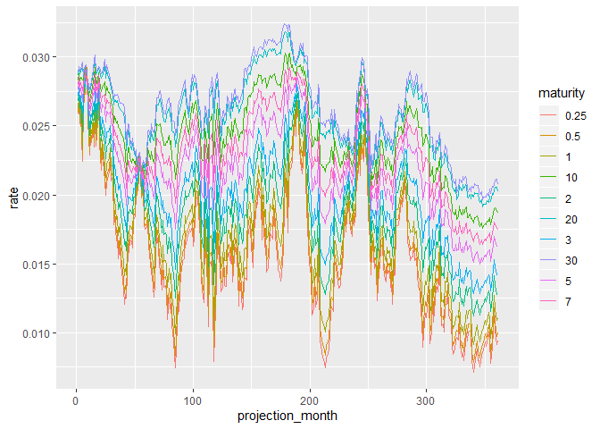

<!-- README.md is generated from README.Rmd. Please edit that file -->

# AIRG

<!-- badges: start -->

[](https://codecov.io/gh/Houstonwp/AIRG?branch=master)
[](https://travis-ci.org/Houstonwp/AIRG)
<!-- badges: end -->

The goal of AIRG is to replicate the functionality of the Academy’s
interest rate generator in R.

## Installation

You can install the development version from
[GitHub](https://github.com/) with:

``` r
# install.packages("devtools")
devtools::install_github("Houstonwp/AIRG")
```

## Example

The following code generates a single 360 yield curve scenario:

``` r
library(AIRG)

maturities <- c(0.25,0.5,1,2,3,5,7,10,20,30)
corr_matrix <- chol(matrix(c(1,-0.19197,0,-0.19197,1,0,0,0,1),nrow=3))

yieldCurve_scenario <- generate_stochastics(360) %>% 
  correlate_stochastics(corr_matrix) %>% 
  generate_processes() %>% 
  generate_rates() %>% 
  fit_parameters(ns_regressors(c(1,20))) %>% 
  interpolate_rates(ns_regressors(maturities))
```

``` r
library(tidyverse)
#> -- Attaching packages -------------------------------------------------------------------------------------------------------------- tidyverse 1.2.1 --
#> v ggplot2 3.2.1     v purrr   0.3.3
#> v tibble  2.1.3     v dplyr   0.8.3
#> v tidyr   1.0.0     v stringr 1.4.0
#> v readr   1.3.1     v forcats 0.4.0
#> -- Conflicts ----------------------------------------------------------------------------------------------------------------- tidyverse_conflicts() --
#> x dplyr::filter() masks stats::filter()
#> x dplyr::lag()    masks stats::lag()

rownames(yieldCurve_scenario)<- maturities

yieldCurve <- as_tibble(t(yieldCurve_scenario)) %>% 
  rownames_to_column(var = "projection_month") %>% 
  mutate(projection_month = as.numeric(projection_month)) %>% 
  pivot_longer(cols = -projection_month, names_to = "maturity", values_to = "rate")

ggplot(yieldCurve, aes(x=projection_month, y = rate)) + geom_line(aes(color=maturity))
```


